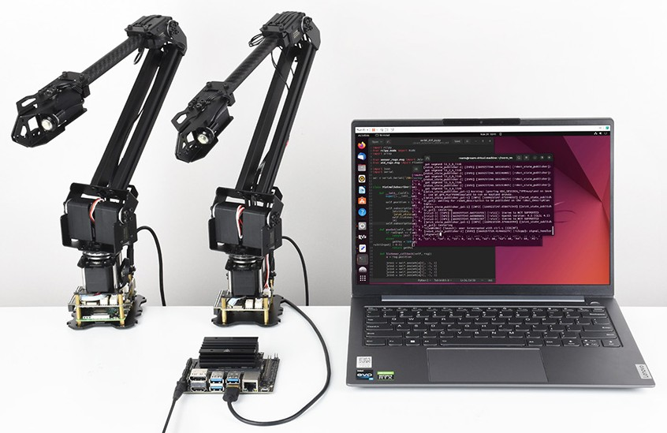
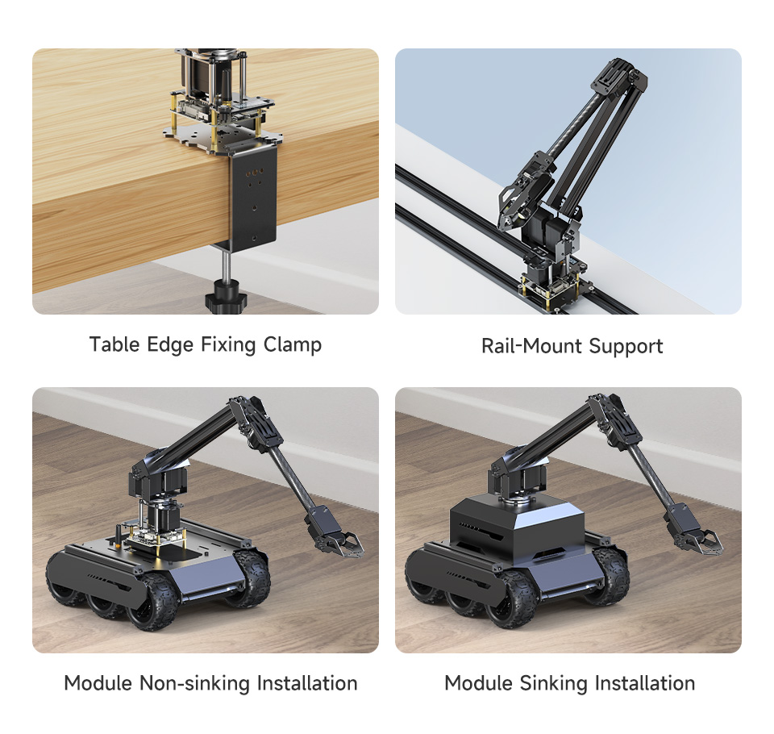
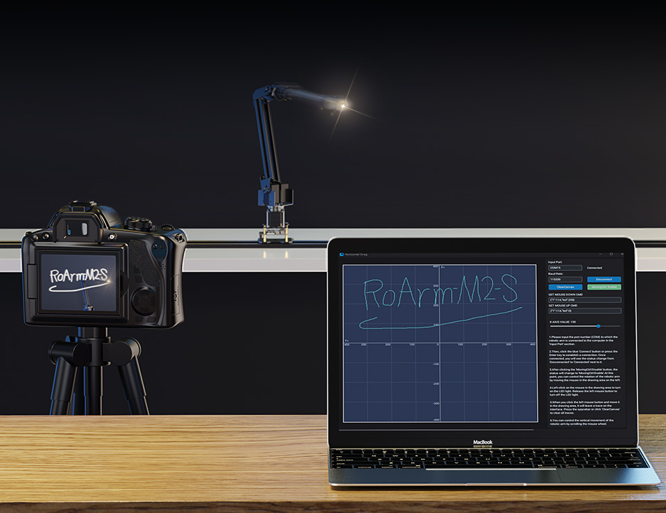

 

  

  <!-- Video Thumbnail -->
  
   
  <!-- Play Button -->
  

# RoArm-M2
RoArm-M2 series is a 4DOF smart robotic arm designed for innovative applications. Adopts lightweight structure design with a total weight of less than 900g and the effective payload of 0.5kg@0.5m, it can be flexibly mounted on various mobile platforms. Adopts a 360°omnidirectional base combined with three flexible joints to create a workspace with a 1-meter diameter.

[Waveshare RoArm-M2 Series](https://www.waveshare.com/roarm-m2-s.htm): **RoArm-M2-S**， **RoArm-M2-Pro**.

## Basic Description
Provides a user-friendly and cross-platform WEB application that integrates a simple and visualized coordinate control mode, making it easier to get started. Comes with rich graphic and video tutorials to help you learn and use it quickly. Compatible with ROS2 and various host computers, supports various wireless and wired communication modes. Comes with an expansion plate, supports customizing the EoAT (End of Arm Tooling) to meet innovative application requirements.

RoArm-M2 series achieves an excellent balance between lightweight, user-friendliness, expandability, and open innovation, it is a multifunctional robotic arm that integrates intelligent control, human-machine interaction, and customizable development. Ideal for applications that require a combination of flexibility, expandability, and user-friendliness.

## Features
- **Expandability**: Comes with various expandable components, and supports multifunctional EoAT (End of Arm Toolings) customization to meet different innovative application needs.
- **Omnidirectional Workspace**: The base, with 360° rotation, combined with flexible joint movements, creates a workspace with a diameter of up to 1 meter, enabling versatile movement in all directions.
- **Easy to use**: Offers cross-platform web applications and coordinate control modes to reduce user difficulties, making it easy for users to operate the robotic arm.
- **Open-source Code**: The control code and communication interface documentation for RoArm-M2-S are open-source, facilitating secondary development for users.
- **Lightweight Structure**: Utilizes carbon fiber and 5052 aluminum alloy, resulting in a body weighing less than 850g, making it easy to install on various mobile platforms.
- **Joint Direct-Drive Design**: Uses 12-bit high-precision magnetic encoders to obtain joint angles, ensuring a repeat positioning accuracy of 0.088°, thereby enhancing structural reliability.
- **Dual-Drive Technology**: Innovative dual-drive technology increases the torque of the robotic arm's shoulder joint, improving the overall load capacity of the robotic arm.
- **Powerful Main Control**: Utilizes the ESP32 main control MCU, supporting various control interfaces and wireless communication protocols.
- **Multi-platform Support**: Compatible with ROS2 and various host computers, supporting multiple wireless and wired communication methods, providing flexibility for different development and control requirements.
- **[Rich Tutorials](www.waveshare.com/wiki/RoArm-M2-S)**: Offers rich graphic and video tutorials covering various functionalities to help users quickly get started and use the robotic arm, thereby accelerating the realization of innovative applications.

## ROS2 + Moveit2 Examples
You can find it here: [RoArm_ROS2_WS](https://github.com/waveshareteam/roarm_ws_em0)

# License
RoArm-M2 for the ESP32: an open source robotics arm.
Copyright (C) 2024 [Waveshare](https://www.waveshare.com/)

This program is free software: you can redistribute it and/or modify
it under the terms of the GNU General Public License as published by
the Free Software Foundation, either version 3 of the License, or
(at your option) any later version.

This program is distributed in the hope that it will be useful,
but WITHOUT ANY WARRANTY; without even the implied warranty of
MERCHANTABILITY or FITNESS FOR A PARTICULAR PURPOSE.  See the
GNU General Public License for more details.

You should have received a copy of the GNU General Public License
along with this program.  If not, see <http://www.gnu.org/licenses/gpl-3.0.txt>.
